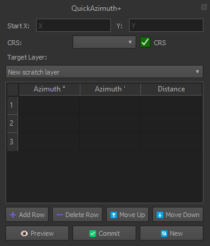

# QuickAzimuthPlus

🧭 **QuickAzimuthPlus** is a QGIS plugin for drawing polygons by entering azimuth (degrees and minutes) and distance values from a base coordinate.  
It also lets you reverse-engineer polygons into azimuth/distance tables for easy editing, with CRS-aware coordinate handling and UTM bounds validation.

## ✨ Features

✅ Input start coordinate (X, Y)  
✅ Choose CRS (Minna / UTM 31N or 32N) with optional transformation  
✅ CRS checkbox:  
   - ✔ Checked → transform to EPSG:26332 (target CRS)  
   - ❌ Unchecked → use coordinates as-is  
✅ Enter azimuth in degrees and minutes  
✅ Enter distance per segment  
✅ Live preview with **red outline rubber band** (transparent fill)  
✅ Automatically zooms to preview geometry  
✅ Commit geometry to any editable polygon layer  
✅ Auto-add and delete row functionality  
✅ ⬆/⬇ buttons to reorder table rows  
✅ Clears everything with "New"  
✅ Opens attribute form on commit  
✅ Reverse-engineering:  
   - Select a polygon → extract azimuth/distance per segment  
   - First vertex displayed in CRS chosen from dropdown  
✅ Supports both single and multipolygon geometries  
✅ Validates UTM coordinate ranges (Easting: 166,021–833,978; Northing: 0–9,339,005)  
✅ Dock closes fully when closed (no hidden state)

## 🖼 Screenshot

## 📦 Installation

1. Download the latest release ZIP from [Releases](https://github.com/mikha651/QuickAzimuthPlus/releases).  
2. In QGIS, go to:  
   - **Plugins > Manage and Install Plugins… > Install from ZIP**  
3. Select the ZIP file and install.  
4. Activate **QuickAzimuthPlus** from the Plugins menu or toolbar.

## 🔗 Links

- [GitHub Repository](https://github.com/mikha651/QuickAzimuthPlus)  
- [Issue Tracker](https://github.com/mikha651/QuickAzimuthPlus/issues)  
- [QGIS Plugin Repository](https://plugins.qgis.org/plugins/QuickAzimuthPlus/) *(after approval)*

## 📜 License

MIT License
