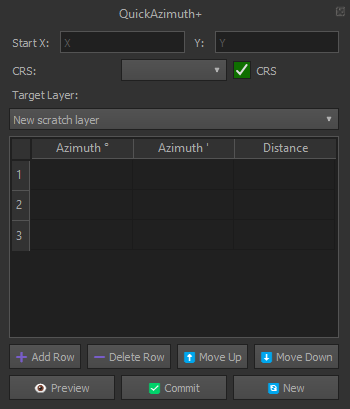

# QuickAzimuthDockable

**QuickAzimuthDockable** is a QGIS plugin that allows you to draw polygons by entering azimuth (degrees + minutes) and distance values starting from a base coordinate. The plugin is dockable, provides real-time preview, and supports easy polygon editing and submission.

## ✨ Features

- Input start coordinate (X, Y)
- Enter azimuth in degrees and minutes
- Enter distance per segment
- Live preview with red polygon
- Commit to any editable polygon layer
- Auto-add row on ENTER key
- Clears everything with "New"
- Opens attribute form upon commit

## 🖼 Screenshot

## 📜 License

MIT